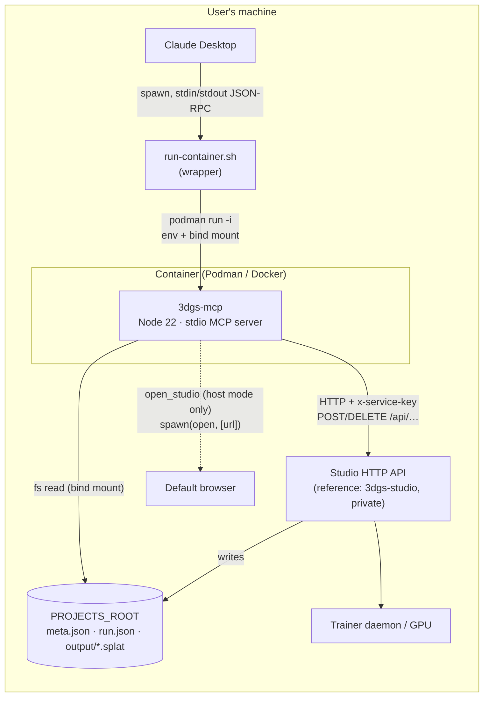
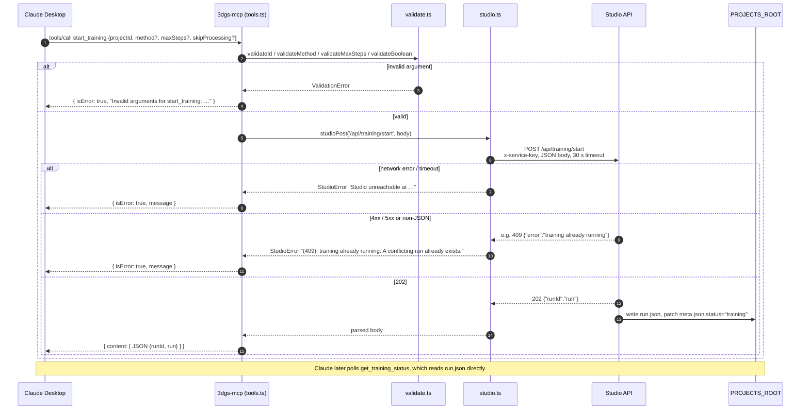
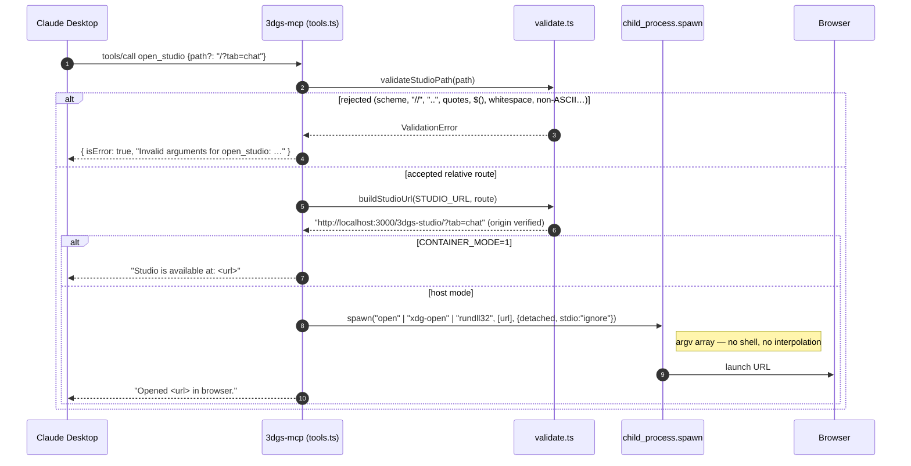

# Architecture

`3dgs-mcp` is a **stdio MCP server** that turns a 3D Gaussian Splatting
studio into eight tools Claude Desktop can call. It has no database and no
background work of its own: it validates input, reads project state from a
shared directory, and forwards mutating actions to the studio's HTTP API.

## Component view



Key boundaries:

| Boundary | Mechanism | Trust |
|----------|-----------|-------|
| Claude Desktop ↔ server | JSON-RPC over stdin/stdout (MCP stdio transport). stderr is logs only. | Tool arguments are **untrusted** model output → validated in `src/validate.ts`. |
| Server ↔ filesystem | Read-only bind mount of `PROJECTS_ROOT` at `/app/data/projects`. | Ids are single path segments, so reads cannot leave the root. |
| Server ↔ studio | Plain HTTP on loopback / container host gateway with a shared `x-service-key`. | Studio is trusted; responses are still checked for status and JSON shape. |
| Server ↔ browser | `spawn()` with an argv array (no shell), only when `CONTAINER_MODE` is unset. | URL is rebuilt with `new URL()` and pinned to the studio origin. |

## Source layout

```
src/
├── index.ts     # stdio bootstrap (loadConfig → createServer → connect)
├── server.ts    # MCP Server wiring: tools/list, tools/call
├── tools.ts     # TOOLS schema + handleToolCall dispatcher + browser opener
├── validate.ts  # argument validators (ids, names, enums, routes, URL join)
├── studio.ts    # HTTP client: headers, timeouts, status + JSON checks
├── projects.ts  # readMeta / readRun / listProjectIds / listSplatFiles
└── config.ts    # env → Config with documented defaults
```

Dependency direction is strictly downward: `index → server → tools →
{validate, studio, projects} → config`. Everything under `tools.ts` is pure
with respect to process state, which is what makes the 149 unit tests cheap.

## Sequence: `start_training`



## Sequence: `open_studio`



## Runtime modes

| Mode | How it starts | `open_studio` | Studio URL |
|------|---------------|---------------|------------|
| **Container** (default, recommended) | Claude Desktop → `run-container.sh` → `podman run -i` | Returns the URL | `localhost` rewritten to `host.containers.internal` / `host.docker.internal` |
| **Host** (development) | `node dist/index.js` | Launches the browser | Used as given |

## Failure handling at a glance

- Every handler returns an MCP result; the process never crashes on a tool
  call. Unexpected exceptions are logged to stderr and reported as
  `isError: true`.
- Filesystem problems degrade to "not found" / empty lists.
- Studio problems map 1:1 to `StudioError` messages that name the HTTP status
  and include the studio's own `error` string plus a remediation hint.

See `docs/SYSTEM_DESIGN.md` for the reasoning behind these choices and
`docs/REQUIREMENTS.md` for the guarantees stated as requirements.
